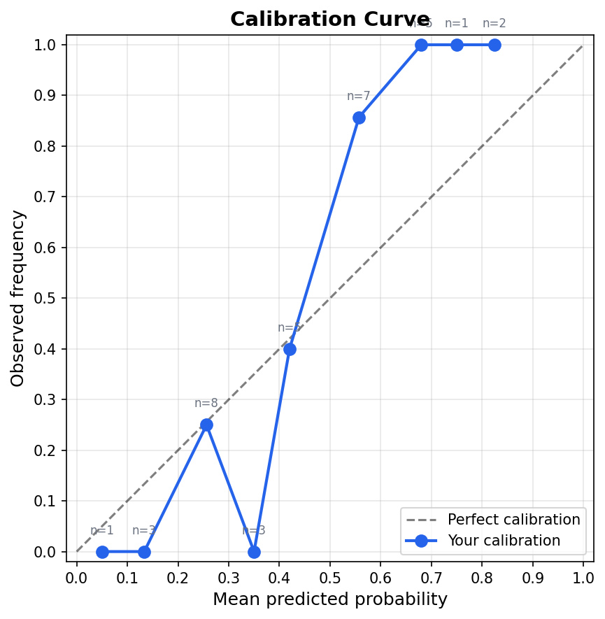

# calibrate

[](LICENSE)
[](https://www.python.org/downloads/)

Forecast calibration tracker. Log predictions, resolve outcomes, get Brier score, log loss, Murphy decomposition, and a calibration curve.

Most people confuse **accuracy** with **calibration**. A well-calibrated forecaster isn't the one who "guessed right" — it's the one whose 70% predictions come true ~70% of the time. This tool measures exactly that: log your probability estimates, resolve them, and see how well-calibrated you actually are.

Useful for prediction markets (Polymarket, Kalshi) and evaluating your own AI-assisted forecasts.



## Features

- **Add predictions** with probability estimates and optional categories
- **Resolve** outcomes as they happen
- **Score** your track record: Brier score, log loss, Murphy decomposition (reliability / resolution / uncertainty)
- **Plot** a calibration curve PNG
- **Seed** with sample data to try it out instantly
- Rich terminal output with colored tables

## Install

```bash
# With uv (recommended)
uv tool install .

# Or with pip
pip install -e .
```

## Quickstart

```bash
# Load sample data to try it out
calibrate seed

# See open predictions
calibrate list

# See all predictions
calibrate list --all

# Add a new prediction
calibrate add "Will GPT-5 ship before September 2026?" 0.7 --category ai

# Resolve a prediction
calibrate resolve 36 yes

# Get your scores
calibrate score

# Break down by category
calibrate score --by-category

# Generate calibration curve
calibrate plot
```

### Example `score` output

```
                     Overall
  Predictions                  35
  Base rate (YES freq)     0.5143
  Brier score              0.148629
  Log loss                 0.462553

  Murphy decomposition
    Reliability            0.018498
    Resolution             0.119869
    Uncertainty            0.250000

    Check: Rel - Res + Unc 0.148629
    Brier score            0.148629
    Identity check         ✓ match
```

## How scoring works

All metrics use only resolved predictions. Let `p` = your probability, `o` ∈ {0, 1} = outcome.

| Metric | Formula | Interpretation |
|--------|---------|----------------|
| **Brier score** | `mean((p - o)²)` | 0 = perfect, 1 = worst. Lower is better. |
| **Log loss** | `-mean(o·ln(p) + (1-o)·ln(1-p))` | Penalizes confident wrong predictions heavily. |
| **Reliability** | `(1/N) Σ nₖ(p̄ₖ - ōₖ)²` | How close bins are to diagonal. Lower = better calibrated. |
| **Resolution** | `(1/N) Σ nₖ(ōₖ - ō)²` | How much your bins differ from base rate. Higher = more informative. |
| **Uncertainty** | `ō(1 - ō)` | Inherent uncertainty of the base rate. |
| **Identity** | `Brier ≈ Reliability - Resolution + Uncertainty` | Self-check — these must match. |

## Data storage

Predictions are stored in `~/.calibrate/predictions.json`. Override with `--data <path>` on any command.
Writes replace the file atomically. `calibrate seed` requires an empty store and refuses to overwrite existing predictions; use `calibrate seed --data demo.json` for a separate demo. Sample data is bundled in the wheel, so seeding also works after `uv tool install .`.

## Roadmap

- [ ] Polymarket / Kalshi import (resolve from market data)
- [ ] Web dashboard (Streamlit or HTMX)
- [ ] Per-category trend charts over time
- [ ] Forecast journal with notes

## License

MIT
